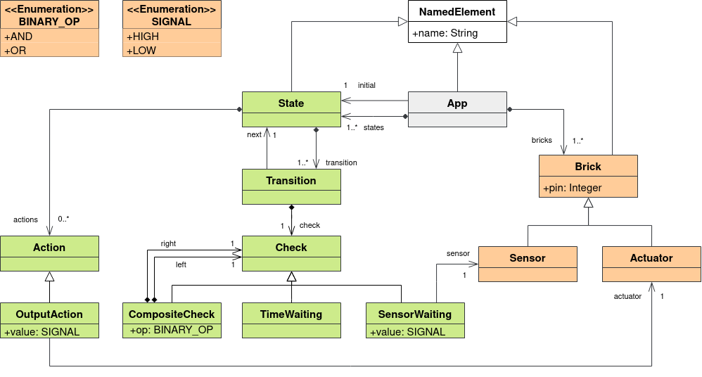

# ArduinoML - Team E

**Course:** Domain Specific Languages

**Professor:** J. Deantoni

**Date:** January 2022 - February 2022

## I. Description

The goal of this project is to implement the ArduinoML language which allows to code simple applications for [Arduino](https://www.arduino.cc/).
It defines an embedded DSL implemented in [Java](https://www.java.com/fr/) and an external DSL built using the [AntLR](https://www.antlr.org/) framework.

## II. Kernel

The kernel of our two languages was implemented in [Java](https://www.java.com/fr/) and defines the following domain model:



## III. Embedded DSL

### 1. Description

The embedded DSL was implemented in [Java](https://www.java.com/fr/).

### 2. Usage

In order to build your own application, you just need to create a class annotated with the `@ArduinoML()` annotation and extend the [EmbeddedApplication](./src/main/java/embedded/builders/EmbeddedApplication.java) class.

Then, the attributes annotated with the `@Input()` and `@Output()` annotations allow to define the sensors and actuators used by the application.

Finally, the methods define the states of the application. 
To define the initial state of the application, you just have to annotate one of the states of the application with the `@Initial()` annotation.
Moreover, within these methods, it is possible to use the `set()`, `when()` and `after()` methods to define various actions and transitions.

```java
@ArduinoML(name = "my-app")
public class MyApplication extends EmbeddedApplication {
    @Input(pin = 8)
    Sensor button;

    @Output(pin = 12)
    Actuator led;

    @Initial
    void off() {
        set(led).to(LOW);
        when(button).is(HIGH).then("on");
    }

    void on() {
        set(led).to(HIGH);
        when(button).is(HIGH).then("off");
    }
}
```

### 3. Compilation

In order to compile your application and get the corresponding Arduino code, you can add a `main()` method to your application with the following code:

```java
@ArduinoML(name = "my-app")
public class MyApplication extends EmbeddedApplication {
    // ==========
    // Code here.
    // ==========
    
    public static void main(String[] args) {
        // Build my app.
        App app = new MyApplication().build();

        // Translate my app.
        Visitor<StringBuffer> codeGenerator = new Generator();
        app.accept(codeGenerator);

        // Print the translation.
        System.out.println(codeGenerator.getGeneratedCode());
    }
} 
```

### 4. Examples

- You can find a set of usage examples in the [`embedded.examples`](src/main/java/embedded/examples) package.

- You can compile all examples using Gradle:

```sh 
gradle compileEmbeddedDslExamples
```

> All application classes located in the [`embedded.examples`](src/main/java/embedded/examples) package will be executed and the resulting Arduino `.ino` files will be placed in the `./out` folder.

## IV. External DSL

### 1. Description

The external DSL was built using the [AntLR](https://www.antlr.org/) framework.
The grammar of this language is available in the [`ArduinoML.g4`](src/main/java/external/antlr/ArduinoML.g4) file.
All other files in the same folder are generated by AntLR from the language grammar.
The [`ModelBuilder`](src/main/java/external/arduinoML/builder/ModelBuilder.java) class is a listener allowing to build an instance of the Domain Model by browsing an AST of our external DSL.
The [`Main`](src/main/java/external/Main.java) class allows to compile a text file written in our external DSL into an Arduino `.ino` file.

### 2. Usage

In order to build your own application, you must use the following syntax:

```
Sensor button on PIN8
Actuator led on PIN12

initial ledOff {
    led is LOW
    when button is HIGH then ledOn
}

ledOn {
    led is HIGH
    when button is HIGH then ledOff
}
```

### 3. Execution

In order to compile your application, you have to execute `main()` method inside the [`Main`](src/main/java/external/Main.java) class passing it two arguments:

- The path of the file to be compiled.
- The name of the output file.

> This generates an Arduino `.ino` file in the source directory.  

### 4. Examples

- You can find a set of usage examples in the [`external.examples`](src/main/java/external/examples) package.

### 5. Syntax highlighting

If you want to add syntax highlighting when editing a file written in ArduinoML with our external DSL, you can easily import the custom [TextMate Bundle](https://macromates.com/manual/en/bundles) that we created in the [`plugins/arduino-ml`](plugins/arduino-ml) folder into your favorite text editor.
By default, this bundle only adds syntax highlighting to files with the `.aml` extension but this is often configurable within the text editors.

#### a. JetBrains

- Navigate to `Settings > Plugins > Installed`, and make sure the `TextMate Bundles` plugin is installed and enabled. This plugin is usually already installed.
- Navigate to `Settings > Editor > TextMate bundles`, and click the `+` button to add a new TextMate bundle.
- Select the [`plugins/arduino-ml`](plugins/arduino-ml) located within this project.
- Click `OK` to apply the changes.
- Syntax highlighting will be automatically applied to files with the `.aml` extension.
- Enjoy ;)

#### b. Visual Studio Code

- Copy the folder [`plugins/arduino-ml`](plugins/arduino-ml) inside the `.vscode/extensions` folder.
- Syntax highlighting will be automatically applied to files with the `.aml` extension.
- Enjoy ;)

#### c. Other text editors

I let you Google [how to install a TextMate Bundle](https://www.youtube.com/watch?v=dQw4w9WgXcQ) on your favorite text editor :^)

## V. Authors

- [João Brilhante](https://github.com/JoaoBrlt)
- [Enzo Briziarelli](https://github.com/enbriziare)
- [Charly Ducrocq](https://github.com/CharlyDucrocq)
- [Quentin Larose](https://github.com/QuentinLarose)
- [Ludovic Marti](https://github.com/LudovicMarti)
